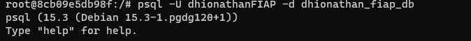
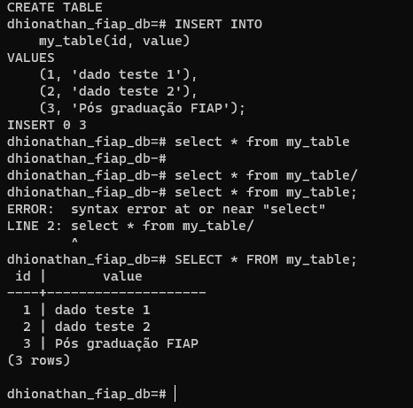
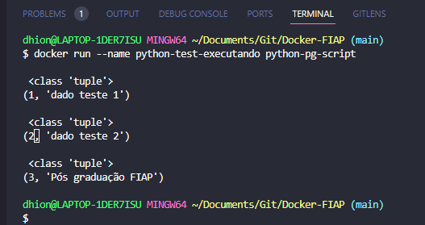

#### Comandos Após criação do container 
- Obter o IP da máquina que está rodando a imagem.
```docker inspect postgresFiapTeste ```  
- Resultado: ```"IPAddress": "172.17.0.3"```.
- Dentro do diretorio onde está a DockerFile, executar:
``` docker build -t python-pg-script ```.
- Entrando no container com o banco de dados 
```docker exec -it postgresFiapTeste /bin/bash``` <- Pelo CMD
- Logar no postgres dentro do container 
```psql -U dhionathanFIAP -d dhionathan_fiap_db```
Exemplo: 
- pic para exemplificar:
- 
- Criando o container no diretorio com o dockerfile
- ```docker build -t python-pg-script .```
- Executando o container fazendo conexão com o banco e consumindo dados:
  ```docker run --name python-test-executando python-pg-script```
- 